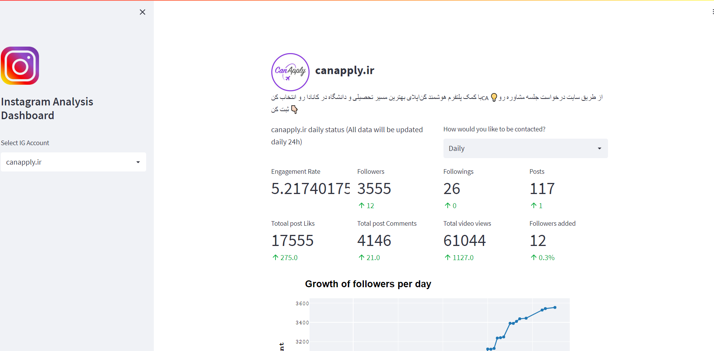

# Instagram Dynamic Dashboard for Promotion and Customer Acquisition Analysis

Instagram stands as a cornerstone in the realm of social media, boasting over 1 billion monthly active users. Harnessing its potential as a powerful marketing channel, I've developed a comprehensive dashboard for analyzing the performance of targeted Instagram accounts. Dive into insightful metrics and optimize your brand promotion strategies with ease.

This project is a part of my portfolio, showcasing my skills. The main code isn't public, but I'm open to collaboration! Interested? Email me at mr.raz2002@gmail.com

Explore the Demo Here (Note: Heroku's free hosting service may experience shutdowns, rendering the dashboard temporarily unavailable):
https://instagramanalytic.herokuapp.com/


<p></p>

### Who can use this dashboard  ?
-  Page  Admin  :   This dashboard can help to measure their performance and optimize their page on instagram
-  Markting teams : Using this dashboard they can see what's popular and get a better understand of their audience
- Investors : Presented metrics on this dashboard can give a better understanding of our performance on Instagram
-  Manager : Using this dashboard, the manager can monitor the performance of the Instagram team or admin

### Whats our metrices on this dashboard ? 

- Total growth of followers per day/weak/month/year
- Total growth of followings per day/weak/month/year
- Total growth of posts per day/weak/month/year
- Total growth of likes per day/weak/month/year
- Total growth of comments per day/weak/month/year
- Total growth of videos views per day/weak/month/year

**You also can comapre and analyze posts to each other and see which posts perform better**

### How this Dashboard works :

#### 1 - Provide the data : 

I used a python package called [instaloader](https://instaloader.github.io/) to collect data every 24h per day 

### 2 - Front Side and Charts :
I used a powerful framework [Streamlit](https://streamlit.io/) to build (front side all in python) and  [plotly](https://plotly.com/) and [matplotlib](https://matplotlib.org/) to build the charts

### 3 - Server and Database : 

I used Heroku a cloud platform as a service which provide a free hosting to deploy my app on it. it's and amzaing platform gave me so much flexbilte to deploy my apps and provide me an free PostgreSQL database and a scheduled service which i used to run my data collecting scripts every 24h all data will be collected 24h and insert into my Heroku PostgreSQL database 

**The Heroku database service has a storage space limit, so I had to stop my data collection operation due to the lack of storage space.**

## How to run the project : 

Install requirements :

```pip install -r requirements.txt```

Run the project :

```streamlit run main.py```

##  Libraries and FrameWorks used in the project

- [streamlit](https://streamlit.io/)
- [pandas](https://pandas.pydata.org/)
- [numpy](https://numpy.org/)
- [plotly](https://plotly.com/)
- [matplotlib](https://matplotlib.org/)
- [psycopg2](https://pypi.org/project/psycopg2/)
- [SQLAlchemy](https://sqlalchemy.org/)

